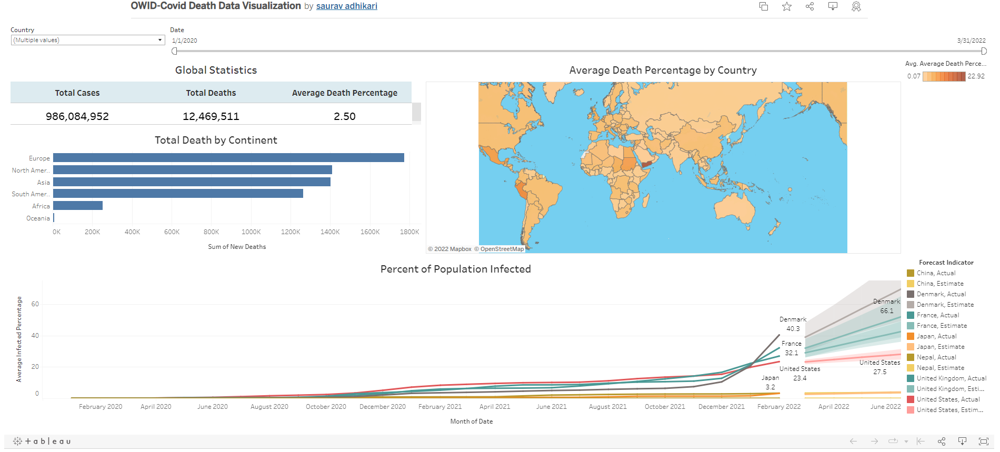
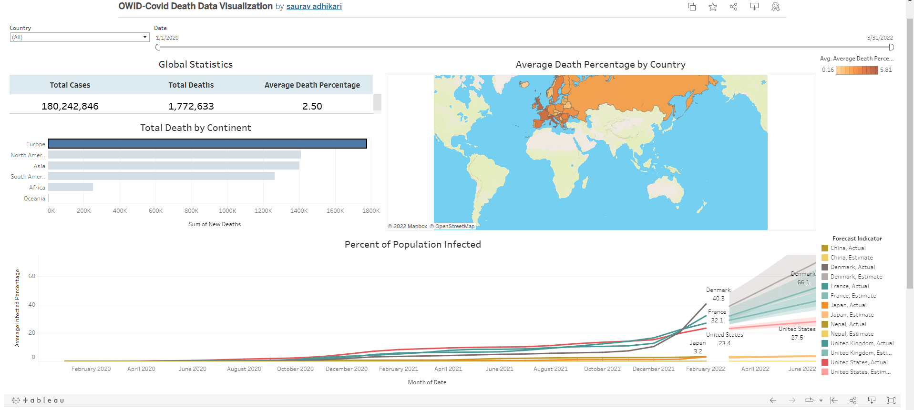

# OWID-Covid-DataExploration-and-DataVisualization
Performing Data Exploration and Data Visualization  on OWID-Covid Dataset

## Table of Content
- [OWID-Covid-DataExploration-and-DataVisualization](#owid-covid-dataexploration-and-datavisualization)
  * [Dataset](#dataset)
  * [Data Exploration using Microsoft Server Management Studio](#data-exploration-using-microsoft-server-management-studio)
    + [For Example:](#for-example)
  * [Data Visualization in Tableau](#data-visualization-in-tableau)
    + [Default Dashboard](#default-dashboard)
    + [Filtering by Continent](#filtering-by-continent)


## Dataset

Download the updated Our World In Data (OWID)-Covid 19 Dataset from [**here**](https://ourworldindata.org/covid-deaths)

The Dataset i used contained data upto March 28, 2022
For easier Exploration and Visualization, Data regarding deaths and vaccinations are seperated into 2 tables during exploration using SQL
 

## Data Exploration using Microsoft Server Management Studio

Create a new database and import the excel files into 2 tables.
I explored the data by looking at the data as a whole, as well as looking at data based on different continents, sorting by highest average infection and death rates and more.

### For Example

Showing countries with highest death count per population.
```sql

Select location,max(cast(total_deaths as int)) as TotalDeathCount, max(population) as Population, 
 Max((cast(total_deaths as int)/population))*100 as Death_rate
From OWID-Database..CovidDeaths$
where continent is not null
Group by location, population
Order by Death_rate desc
```

## Data Visualization in Tableau 

First, Connect tableau desktop to Microsoft SQL Server. 

I have created 2 dashboards (Covid-Deaths, Covid-Vaccinations) and attached it onto a story. You can check it out by visiting the link below. [**Click here.**](https://public.tableau.com/app/profile/saurav.adhikari2682/viz/OWID-CovidDeathDataVisualization/CovidDeaths) 

### Default Dashboard



### Filtering by Continent




